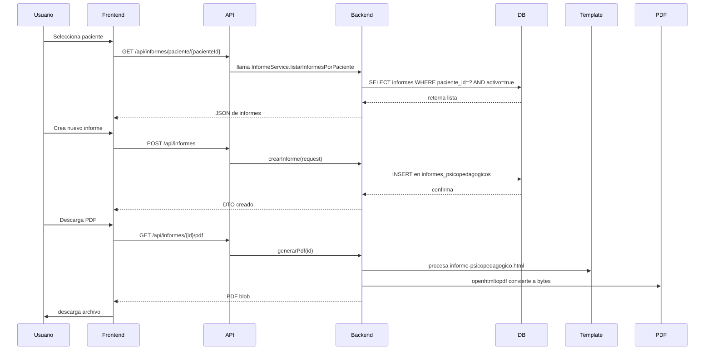

# Documentación de Informes Psicopedagógicos

## 1. Alcance

Este documento describe la implementación de los informes psicopedagógicos en el proyecto Udipsai. Cubre:

- La carpeta `udipsai-front/src/pages/Fichas/Informes`
- La plantilla HTML `udipsai-back/src/main/resources/templates/reportes/informe-psicopedagogico.html`
- La carpeta backend `udipsai-back/src/main/java/com/ucacue/udipsai/modules/informes`

## 2. Resumen funcional

Los informes psicopedagógicos son registros formales asociados a un paciente.

Funcionalidades principales:

1. Seleccionar un paciente disponible para crear o consultar informes.
2. Filtrar pacientes por nombre, cédula, edad, nivel educativo, año de ficha y área atendida.
3. Listar informes existentes de un paciente.
4. Crear un nuevo informe psicopedagógico.
5. Editar un informe existente.
6. Eliminar un informe (soft delete, marca `activo=false`).
7. Descargar el informe en formato PDF y Word.

## 3. Ruta y navegación

### Frontend

Las rutas principales en el módulo de fichas son:

- `/fichas/informes` → Selector de paciente
- `/fichas/informes/:pacienteId` → Lista de informes del paciente
- `/fichas/informes/nuevo/:pacienteId` → Formulario creación informe
- `/fichas/informes/editar/:id` → Formulario edición informe

Estas rutas están protegidas por la autorización `PERM_PACIENTES`.

## 4. Estructura frontend

### 4.1 `SelectorPacienteInformes.tsx`

Propósito:

- Mostrar pacientes activos
- Permitir búsqueda y filtros
- Redirigir a la lista de informes del paciente

Comportamiento:

- Llama a `pacientesService.listarActivos(0, 1000)` al cargar.
- Aplica filtros mediante `pacientesService.filtrar(...)`.
- Campo de búsqueda libre por nombre o cédula.
- Botón para limpiar filtros.
- Navega a `/fichas/informes/${pacienteId}` al seleccionar paciente.

### 4.2 `ListaInformes.tsx`

Propósito:

- Mostrar los informes asociados a un paciente
- Ofrecer acciones de descarga, edición y eliminación

Comportamiento:

- Carga informes con `informesService.listarPorPaciente(pacienteId)`.
- Muestra columnas: N° ficha, paciente, fecha elaboración, fecha lectura, acciones.
- Descarga PDF mediante `informesService.descargarPdf(...)`.
- Descarga Word mediante `informesService.descargarWord(...)`.
- Edita con ruta `/fichas/informes/editar/${inf.id}`.
- Elimina tras confirmación y actualiza la lista en pantalla.

### 4.3 `NuevoInforme.tsx` y `EditarInforme.tsx`

Propósito:

- Capture los datos requeridos por el informe psicopedagógico.
- Envíe los datos a la API para creación o actualización.

Campos principales que maneja el formulario:

- `numeroFicha`
- `representante`
- `parentesco`
- `fechasEvaluacion`
- `fechaElaboracionInforme`
- `fechaLecturaInforme`
- `motivoConsulta`
- `historiaEscolar`
- `psicobiografia`
- `observacionConsulta`
- `reactivosPsicologiaEducativa`
- `reactivosPsicologiaClinica`
- `conclusiones`
- `recomendacionesInstitucion`
- `recomendacionesRepresentante`
- `areaPsicologiaEducativa`
- `evaluadorPsicologiaEducativa`
- `profesionalPsicologiaEducativa`
- `areaPsicologiaClinica`
- `evaluadorPsicologiaClinica`
- `profesionalPsicologiaClinica`
- `coordinadora`

Funciones clave de formulario:

- Guardar informe con `informesService.crear(...)`.
- Actualizar informe con `informesService.actualizar(...)`.
- Redirigir a la lista del paciente tras guardar.

## 5. Servicio frontend `informesService`

### Endpoints utilizados

- `GET /api/informes` → Listar todos los informes.
- `GET /api/informes/paciente/{pacienteId}` → Listar informes por paciente.
- `GET /api/informes/{id}` → Obtener informe.
- `POST /api/informes` → Crear informe.
- `PUT /api/informes/{id}` → Actualizar informe.
- `DELETE /api/informes/{id}` → Eliminar informe.
- `GET /api/informes/{id}/pdf` → Descargar PDF.
- `GET /api/informes/{id}/word` → Descargar Word.

### Descarga de archivos

- Convierte el blob HTTP en un `Blob` local.
- Genera un `ObjectURL` y fuerza la descarga.
- Usa nombres seguros sin espacios ni caracteres inválidos.

## 6. Estructura backend

### 6.1 `InformeController.java`

Responsabilidad:

- Exponer la API REST para CRUD de informes.
- Controlar descargas de PDF y Word.
- Aplicar seguridad con `@PreAuthorize("hasAuthority('PERM_PACIENTES')")`.

Acciones implementadas:

- `listar()` → lista todos los informes activos.
- `listarPorPaciente(pacienteId)` → lista informes activos por paciente.
- `obtener(id)` → obtiene un informe específico.
- `crear(request)` → crea un informe nuevo.
- `actualizar(id, request)` → actualiza un informe.
- `eliminar(id)` → marca informe como inactivo.
- `descargarPdf(id)` → devuelve PDF generado.
- `descargarWord(id)` → devuelve Word generado.

### 6.2 `InformeService.java`

Responsabilidad:

- Lógica de negocio para informes.
- Mapeo entre `InformeRequest` y `InformePsicopedagogico`.
- Conversión de entidad a DTO.
- Generación de PDF con plantilla HTML.

Puntos importantes:

- `listarInformesPorPaciente` usa `repository.findByPacienteIdAndActivo(pacienteId, true)`.
- `crearInforme` asocia la entidad `Paciente` y guarda el informe.
- `actualizarInforme` reutiliza `mapToEntity(...)` para cargar cambios.
- `eliminarInforme` hace soft delete: `activo=false`.
- `generarPdf` crea un mapa de datos y delega a `pdfService.generatePdfFromHtml("reportes/informe-psicopedagogico", datos)`.

### 6.3 `InformeRepository.java`

Responsabilidad:

- Operaciones de acceso a datos para `InformePsicopedagogico`.
- Define consultas por convención de Spring Data JPA.

Métodos:

- `findByPacienteIdAndActivo(Integer pacienteId, Boolean activo)`
- `findByActivo(Boolean activo)`

### 6.4 `InformePsicopedagogico.java`

Entidad JPA con campos clave:

- `paciente` (relación ManyToOne)
- `numeroFicha`
- `representante`
- `parentesco`
- `fechasEvaluacion`
- `fechaElaboracionInforme`
- `fechaLecturaInforme`
- `motivoConsulta`
- `historiaEscolar`
- `psicobiografia`
- `observacionConsulta`
- `reactivosPsicologiaEducativa`
- `reactivosPsicologiaClinica`
- `conclusiones`
- `recomendacionesInstitucion`
- `recomendacionesRepresentante`
- `areaPsicologiaEducativa`
- `evaluadorPsicologiaEducativa`
- `profesionalPsicologiaEducativa`
- `areaPsicologiaClinica`
- `evaluadorPsicologiaClinica`
- `profesionalPsicologiaClinica`
- `coordinadora`
- `activo`
- `fechaCreacion`

## 7. Plantilla PDF `informe-psicopedagogico.html`

### Tecnología

- HTML + CSS con Thymeleaf (`th:text` y condiciones `th:if`).
- Generación de PDF con `openhtmltopdf` en `PdfService.java`.
- Recursos de imagen embedidos en Base64: `logoUcacueBase64`, `footerUcacueBase64`.

### Estructura del documento

1. Encabezado con logo, título y metadatos.
2. Sección 1: Datos de identificación.
3. Sección 2: Motivo de consulta.
4. Sección 3: Historia escolar.
5. Sección 4: Psicobiografía.
6. Sección 5: Observación en la consulta.
7. Sección 6: Reactivos aplicados y resultados.
8. Sección 7: Conclusiones.
9. Sección 8: Recomendaciones para la institución.
10. Sección 9: Recomendaciones para el representante.
11. Sección 10: Profesionales responsables.
12. Firma del representante.

### Campos inyectados por el backend

- `pacienteNombre`
- `pacienteFechaNacTexto`
- `pacienteEdad`
- `pacienteTelefono`
- `pacienteInstitucion`
- `pacienteNivel`
- `pacienteAnio`
- `fechasEvaluacionTexto`
- `fechaElaboracion`
- `fechaLectura`
- `informe` (objeto completo)
- `logoUcacueBase64`
- `footerUcacueBase64`

### Estilo visual

- Formato A4 con márgenes definidos.
- Marco fijo de página (borde en cada cara).
- Encabezado y pie repetidos en cada página.
- Tipografía serif clásica.
- Secciones con títulos mayúscula y subrayado.
- Texto justificado y compatibilidad con salto de página.

## 8. Diagrama de flujo

### 8.1 Secuencia de creación de informe


```

## 9. Requisitos funcionales

1. El usuario debe poder buscar y filtrar pacientes antes de crear o ver informes.
2. El sistema debe mostrar únicamente informes activos.
3. El usuario debe poder crear informes con todos los campos psicopedagógicos requeridos.
4. El usuario debe poder editar un informe existente.
5. El usuario debe poder eliminar un informe mediante soft delete.
6. El usuario debe poder descargar informes en formato PDF y Word.
7. El sistema debe registrar automáticamente el paciente y la fecha de creación.
8. El sistema debe incluir en el PDF los datos del paciente, fechas y responsables.

## 10. Requisitos no funcionales

1. La carga de datos debe ser rápida y confiable mediante paginación o límites razonables.
2. El PDF debe generarse en formato A4 con encabezado y pie constantes.
3. El acceso a las rutas debe estar protegido por permisos de usuario.
4. El sistema debe manejar datos faltantes con valores por defecto (por ejemplo, coordinadora).
5. Las descargas deben ser seguras y no permitir inyección de contenido.
6. El diseño debe ser fácil de entender y consistente con el resto del módulo Fichas.
7. El código debe estar organizado en capas: controlador, servicio, repositorio y vista.

## 11. Manual de usuario

### 11.1 Consultar informes

1. Ingrese a `Fichas` → `Informes Psicopedagógicos`.
2. Use el campo de búsqueda para filtrar por nombre o cédula.
3. Si lo desea, abra el panel de filtros y seleccione edad, nivel educativo, año de ficha o área atendida.
4. Haga clic en el paciente deseado.
5. Revise la lista de informes del paciente.
6. Use los botones `PDF` o `Word` para descargar el informe.

### 11.2 Crear un informe

1. Desde la lista de informes de un paciente, presione `+ Nuevo informe`.
2. Complete los campos del formulario.
3. Presione `Guardar`.
4. El informe se guardará y volverá a la lista.

### 11.3 Editar un informe

1. En la lista de informes, presione el botón de editar (✏️) junto al informe.
2. Modifique los campos necesarios.
3. Guarde los cambios.
4. El informe actualizado se mostrará en la lista.

### 11.4 Eliminar un informe

1. En la lista de informes, haga clic en el botón de eliminación (🗑️).
2. Confirme la acción.
3. El informe será marcado como inactivo y desaparecerá de la lista.

## 12. Notas de desarrollo

- El backend usa Spring Boot, JPA y Thymeleaf para PDF.
- El frontend usa React con TS, `react-router` y servicios HTTP centralizados.
- La plantilla `informe-psicopedagogico.html` está dentro de `src/main/resources/templates/reportes`.
- La conversión a PDF inserta automáticamente los logos de UCACUE como Base64.
- El servicio `PdfService` usa `PdfRendererBuilder` de `openhtmltopdf`.

## 13. Referencias de archivos

- Front:
  - `udipsai-front/src/pages/Fichas/Informes/SelectorPacienteInformes.tsx`
  - `udipsai-front/src/pages/Fichas/Informes/ListaInformes.tsx`
  - `udipsai-front/src/pages/Fichas/Informes/NuevoInforme.tsx`
  - `udipsai-front/src/pages/Fichas/Informes/EditarInforme.tsx`
  - `udipsai-front/src/services/informes.ts`
  - `udipsai-front/src/routes/config.tsx`

- Back:
  - `udipsai-back/src/main/java/com/ucacue/udipsai/modules/informes/controller/InformeController.java`
  - `udipsai-back/src/main/java/com/ucacue/udipsai/modules/informes/service/InformeService.java`
  - `udipsai-back/src/main/java/com/ucacue/udipsai/modules/informes/repository/InformeRepository.java`
  - `udipsai-back/src/main/java/com/ucacue/udipsai/modules/informes/domain/InformePsicopedagogico.java`
  - `udipsai-back/src/main/resources/templates/reportes/informe-psicopedagogico.html`
  - `udipsai-back/src/main/java/com/ucacue/udipsai/common/report/PdfService.java`
