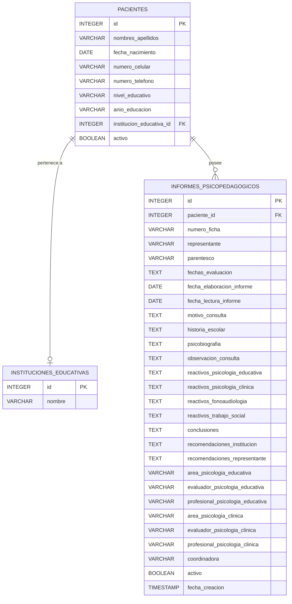
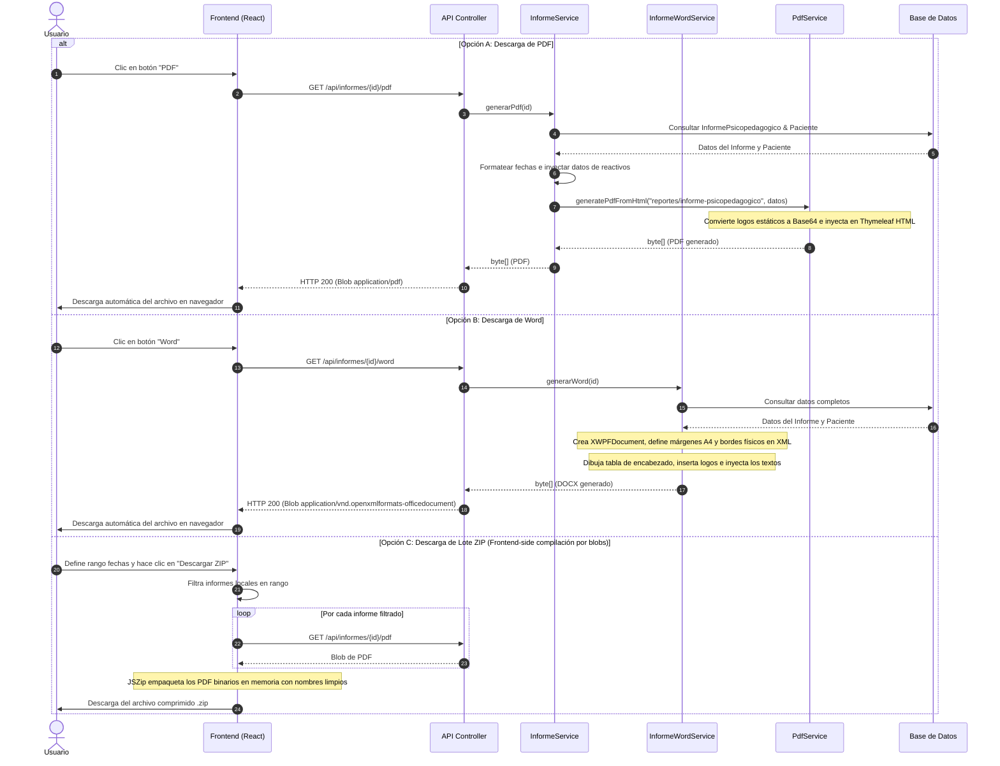

# Manual Técnico y de Levantamiento de Información: Módulo de Informes Psicopedagógicos

Este documento proporciona una descripción detallada, técnica y funcional del módulo de **Informes Psicopedagógicos** implementado en la plataforma **UDIPSAI** (Unidad de Diagnóstico, Investigación Psicopedagógica y Apoyo a la Inclusión). Está diseñado para servir como manual de referencia para futuros desarrolladores, analistas de sistemas e investigadores del área.

---

## 1. Resumen Ejecutivo y Propósito

El módulo de **Informes Psicopedagógicos** tiene como objetivo central centralizar, estructurar, editar y exportar los resultados del diagnóstico y evaluación de pacientes atendidos en la UDIPSAI. Este informe actúa como el documento oficial que consolida la valoración integral de las áreas de **Psicología Educativa**, **Psicología Clínica**, **Fonoaudiología** y **Trabajo Social**.

El sistema permite:
1. **Consolidar los datos** demográficos y académicos del paciente.
2. **Registrar de forma estructurada** la anamnesis, historia escolar, psicobiografía y observaciones de consulta.
3. **Detallar los reactivos evaluativos** aplicados por área con sus respectivos resultados y comentarios.
4. **Generar conclusiones y recomendaciones** específicas destinadas tanto a la institución educativa del paciente como a sus representantes legales.
5. **Exportar copias idénticas** en formatos de alta fidelidad: **PDF** (para distribución formal con firma de autoridades) y **Word** (para edición final o complementación fuera de línea).
6. **Compilar y descargar múltiples informes** en un solo archivo comprimido **ZIP** filtrado por rangos de fecha.

---

## 2. Recolección y Estructura de Información

El diseño de la base de datos y la interfaz de usuario se basó en los formularios de diagnóstico oficiales de la Universidad Católica de Cuenca. A continuación se detalla el origen, tipo de dato y propósito de cada campo que compone el informe:

### 2.1 Datos Demográficos (Obtenidos del Paciente)
Estos campos no se almacenan directamente en la tabla de informes; se consultan en tiempo de ejecución desde la entidad `Paciente` para garantizar la consistencia de los datos:

| Campo en Reporte | Tipo de Dato | Origen (Tabla `pacientes`) | Descripción / Justificación |
| :--- | :--- | :--- | :--- |
| **Nombres y Apellidos** | `VARCHAR(150)` | `paciente.nombresApellidos` | Identificación legal del evaluado. |
| **Fecha de Nacimiento** | `DATE` | `paciente.fechaNacimiento` | Base para el cálculo preciso de la edad cronológica. |
| **Edad** | `Cálculo` | Derivado de `fechaNacimiento` | Muestra la edad en años al momento de emitir el reporte. |
| **Teléfono de Contacto** | `VARCHAR(20)` | `paciente.numeroCelular` / `telefono` | Contacto rápido del representante para seguimiento o citas. |
| **Institución Educativa**| Relación | `paciente.institucionEducativa.nombre`| Centro escolar donde se derivará el plan de adaptaciones. |
| **Nivel Educativo** | `VARCHAR(100)`| `paciente.nivelEducativo` | Inicial, Básica Elemental, Media, Superior o Bachillerato. |
| **Año que Cursa** | `VARCHAR(50)` | `paciente.anioEducacion` | Grado escolar exacto (ej. "Quinto Año de EGB"). |

### 2.2 Campos Propios del Informe (Tabla `informes_psicopedagogicos`)
Estos campos representan el contenido narrativo, las fechas del proceso y las firmas de responsabilidad:

| Campo Base de Datos | Tipo de Dato / UI | Descripción | Justificación del Campo |
| :--- | :--- | :--- | :--- |
| `id` | `SERIAL` (PK) | Identificador único del informe. | Control relacional interno. |
| `numero_ficha` | `VARCHAR(20)` / Text | Número físico o correlativo de la ficha acumulativa. | Trazabilidad física en el archivo de UDIPSAI. |
| `representante` | `VARCHAR(150)` / Text | Nombre completo del padre, madre o tutor legal. | Destinatario legal de las recomendaciones familiares. |
| `parentesco` | `VARCHAR(50)` / Text | Vínculo familiar (Madre, Padre, Tío, etc.). | Contextualización del responsable del menor. |
| `fechas_evaluacion` | `TEXT` / Text área | Fechas en las que se aplicaron los reactivos. | Registro cronológico del proceso psicométrico. |
| `fecha_elaboracion_informe` | `DATE` / Date picker | Fecha en la que el profesional redacta el documento. | Validez temporal del informe técnico. |
| `fecha_lectura_informe` | `DATE` / Date picker | Fecha de entrega y socialización con la familia. | Evidencia del cumplimiento de devolución del diagnóstico. |
| `motivo_consulta` | `TEXT` / Text área | Razón por la que el paciente fue derivado a la unidad. | Describe el síntoma inicial o problema reportado. |
| `historia_escolar` | `TEXT` / Text área | Antecedentes académicos y de adaptación conductual. | Permite identificar dificultades previas en el desarrollo. |
| `psicobiografia` | `TEXT` / Text área | Hitos del desarrollo (motor, lenguaje, psicofisiológico). | Contexto prenatal, perinatal y post-natal relevante. |
| `observacion_consulta` | `TEXT` / Text área | Comportamiento del paciente durante las sesiones. | Datos cualitativos (atención, fatiga, motricidad, actitud). |
| `reactivos_psicologia_educativa`| `TEXT` / Text área | Reactivos (WISC-V, PROLEC-R, etc.) y resultados. | Sustento psicométrico del área educativa. |
| `reactivos_psicologia_clinica`| `TEXT` / Text área | Reactivos de personalidad, emocional o conductual. | Sustento clínico del perfil del paciente. |
| `reactivos_fonoaudiologia` | `TEXT` / Text área | Reactivos de lenguaje y audición. | Sustento fonoaudiológico opcional. |
| `reactivos_trabajo_social` | `TEXT` / Text área | Visita domiciliaria o ficha socioeconómica. | Sustento del entorno familiar y social. |
| `conclusiones` | `TEXT` / Text área | Diagnóstico definitivo o síntesis diagnóstica. | Declaración formal de necesidades educativas especiales. |
| `recomendaciones_institucion` | `TEXT` / Text área | Estrategias pedagógicas y adaptaciones curriculares. | Instrucciones directas para los docentes en el aula. |
| `recomendaciones_representante`| `TEXT` / Text área | Pautas de apoyo en el hogar y derivaciones externas. | Guía para la familia en la crianza y estimulación. |
| `area_psicologia_educativa` | `VARCHAR(100)` | Título del área (ej: "Psicología Educativa"). | Nombre del área responsable 1. |
| `evaluador_psicologia_educativa`| `VARCHAR(150)` | Practicante o evaluador que aplicó las pruebas. | Firma de responsabilidad operativa. |
| `profesional_psicologia_educativa`| `VARCHAR(150)` | Psicólogo/a tutor/a que avala la evaluación. | Firma de responsabilidad profesional. |
| `area_psicologia_clinica` | `VARCHAR(100)` | Título del área (ej: "Psicología Clínica"). | Nombre del área responsable 2. |
| `evaluador_psicologia_clinica`| `VARCHAR(150)` | Practicante del área clínica evaluador. | Firma de responsabilidad operativa clínica. |
| `profesional_psicologia_clinica`| `VARCHAR(150)` | Psicólogo/a clínico/a supervisor/a. | Firma de responsabilidad profesional clínica. |
| `coordinadora` | `VARCHAR(200)` | Coordinadora general de la unidad (con título). | Aval institucional de la UDIPSAI. |
| `activo` | `BOOLEAN` | Indica si el informe está activo o borrado. | Permite implementar borrado lógico (*soft delete*). |
| `fecha_creacion` | `TIMESTAMP` | Marca temporal automática de creación. | Auditoría técnica del registro. |

---

## 3. Diagramas del Sistema

A continuación se presentan los diagramas de modelado que representan el funcionamiento lógico, el flujo de datos y la relación entre componentes.

### 3.1 Diagrama de Casos de Uso
Representa las interacciones de los distintos actores del sistema y los permisos necesarios para realizar cada acción:

```mermaid
usecaseDiagram
  actor Profesional as "Profesional Psicopedagógico\n(Permiso: PERM_PACIENTES, PERM_INFORMES)"
  actor OperadorCreacion as "Profesional Evaluador\n(Permiso: PERM_INFORMES_CREAR)"
  actor Administrador as "Administrador / Coordinadora\n(Permisos Totales)"

  Profesional --> (Visualizar lista de pacientes y buscar)
  Profesional --> (Listar informes de un paciente)
  Profesional --> (Descargar informe en PDF)
  Profesional --> (Descargar informe en Word)
  Profesional --> (Exportar lote ZIP de informes)

  OperadorCreacion --> (Crear nuevo informe)
  OperadorCreacion --> (Editar informe existente)

  Administrador --> (Eliminar informe - Soft Delete)
  Administrador --> (Listar informes)
```

### 3.2 Diagrama de Arquitectura de Módulos (Flujo Físico)
Ilustra cómo interactúan los componentes tecnológicos durante la consulta, almacenamiento y generación de reportes:

```mermaid
graph TD
  subgraph Frontend "Capa de Presentación (React + TS)"
    UI[Interfaz de Usuario: Fichas & Informes]
    Services[Servicio informesService]
    JSZip[JSZip Library]
  end

  subgraph Backend "Capa de Negocio (Spring Boot)"
    Controller[InformeController]
    Service[InformeService]
    WordService[InformeWordService]
    PdfService[PdfService]
  end

  subgraph Base de Datos "Capa de Datos (PostgreSQL)"
    DB[(PostgreSQL)]
  end

  subgraph Motor Generador "Librerías de Exportación"
    Thyme[Motor Thymeleaf]
    OpenHtml[openhtmltopdf Builder]
    Poi[Apache POI - XWPF]
  end

  UI -->|Solicita CRUD / Descargas| Services
  Services -->|Llamadas HTTP REST| Controller
  Controller -->|Invoca Servicios| Service
  Controller -->|Invoca Generación Word| WordService
  Service -->|Consultas JPA| DB
  
  Service -->|Prepara Mapa de Datos| PdfService
  PdfService -->|Renderiza HTML| Thyme
  Thyme -->|Envía DOM HTML| OpenHtml
  OpenHtml -->|Retorna byte array PDF| Service
  
  WordService -->|Manipula XML & Estilos| Poi
  Poi -->|Retorna byte array DOCX| WordService

  Service -->|Compila en memoria con ZipOutputStream| Controller
  JSZip -.->|Compilación alternativa local| UI
```

### 3.3 Diagrama Entidad-Relación (Base de Datos)
Muestra las tablas involucradas y sus restricciones relacionales:



### 3.4 Diagrama de Secuencia: Flujo de Generación de Archivos
Muestra el ciclo de vida de una petición para descargar un archivo (PDF, Word o ZIP):



---

## 4. Implementación del Backend (Spring Boot)

La capa del servidor se desarrolla con una arquitectura en capas, garantizando el aislamiento de responsabilidades.

### 4.1 Entidad de Persistencia
La clase [InformePsicopedagogico.java](file:///c:/Users/Usuario/Desktop/Proyectos/udipsai-main/udipsai-back/src/main/java/com/ucacue/udipsai/modules/informes/domain/InformePsicopedagogico.java) modela la tabla `informes_psicopedagogicos`.
- **Relaciones**: Usa una carga perezosa (`FetchType.LAZY`) para la relación `@ManyToOne` con `Paciente`, optimizando las consultas SQL.
- **Campos Narrativos**: Se declaran con `@Column(columnDefinition = "TEXT")` para evitar limitaciones de longitud (`255` caracteres) y permitir explicaciones de diagnóstico extensas.

### 4.2 Lógica de Negocio y CRUD
La clase [InformeService.java](file:///c:/Users/Usuario/Desktop/Proyectos/udipsai-main/udipsai-back/src/main/java/com/ucacue/udipsai/modules/informes/service/InformeService.java) centraliza las operaciones del módulo:
- **Borrado Lógico**: El método `eliminarInforme(Integer id)` no ejecuta una sentencia SQL `DELETE`. En su lugar, establece la bandera `activo = false` en la base de datos.
- **Punto Clave (Coordinadora por Defecto)**: Si el usuario no ingresa el nombre de la coordinadora, el backend asigna automáticamente el valor predeterminado `"Lcda. Gabriela Jara S., Mgtr."` (constante `COORDINADORA_DEFAULT`).

### 4.3 Generación de Reportes PDF
El renderizado del PDF lo realiza `PdfService` usando la librería `openhtmltopdf`:
1. **Thymeleaf Template**: Se utiliza el archivo HTML [informe-psicopedagogico.html](file:///c:/Users/Usuario/Desktop/Proyectos/udipsai-main/udipsai-back/src/main/resources/templates/reportes/informe-psicopedagogico.html).
2. **Inyección de Imágenes Estáticas**: Los logos corporativos (logo superior y pie de página) se cargan desde el classpath del servidor, se convierten a una cadena **Base64** en el backend y se inyectan en el mapa de variables del motor HTML. Esto evita problemas de rutas absolutas rotas al compilar el PDF en diferentes entornos de ejecución (Windows / Linux).
3. **Paginación CSS**: La plantilla define estilos de paginación específicos para evitar huérfanas en los saltos de hoja:
   - `-fs-table-paginate: paginate;` obliga a la tabla general a separar y repetir cabeceras en páginas subsiguientes de forma automatizada.
   - `page-break-inside: avoid;` en bloques de firmas y títulos evita que las secciones queden divididas a la mitad de una hoja.

### 4.4 Generación de Reportes Word (Apache POI)
La clase [InformeWordService.java](file:///c:/Users/Usuario/Desktop/Proyectos/udipsai-main/udipsai-back/src/main/java/com/ucacue/udipsai/modules/informes/service/InformeWordService.java) construye el archivo `.docx` de forma procedural:
1. **Configuración de Página (Márgenes y Tamaño)**:
   A través del objeto `CTSectPr` (XML Schema subyacente de Office Open XML) se define el tamaño exacto A4 (ancho `11906` dxa, alto `16838` dxa) y márgenes de contenido de `900` dxa.
2. **Bordes Físicos de Página**:
   Para replicar el marco estético del PDF, se inyectan bordes en el XML mediante `CTPageBorders`:
   ```java
   CTPageBorders borders = sectPr.addNewPgBorders();
   borders.addNewTop().setVal(STBorder.SINGLE);
   // Define el grosor y separación del borde respecto al borde de la página
   ```
3. **Encabezado y Pie de Página Corporativos**:
   Usa `XWPFHeaderFooterPolicy` para crear el área de cabecera predeterminada, implementando una tabla invisible de una fila y tres columnas para colocar el logo UCACUE a la izquierda, el título centrado y los metadatos (Código de Calidad, Versión y Fecha) a la derecha.

---

## 5. Implementación del Frontend (React + TypeScript)

El módulo del frontend está estructurado de manera modular y limpia en el directorio [udipsai-front/src/pages/Fichas/Informes](file:///c:/Users/Usuario/Desktop/Proyectos/udipsai-main/udipsai-front/src/pages/Fichas/Informes).

### 5.1 Flujo de Navegación y Rutas
Las rutas del módulo están declaradas y protegidas por roles en [routes/config.tsx](file:///c:/Users/Usuario/Desktop/Proyectos/udipsai-main/udipsai-front/src/routes/config.tsx):

- `/fichas/informes`: Muestra el componente [SelectorPacienteInformes.tsx](file:///c:/Users/Usuario/Desktop/Proyectos/udipsai-main/udipsai-front/src/pages/Fichas/Informes/SelectorPacienteInformes.tsx). Aquí se cargan todos los pacientes activos de la base de datos y se ofrece un formulario de búsqueda libre y panel de filtros.
- `/fichas/informes/:pacienteId`: Muestra [ListaInformes.tsx](file:///c:/Users/Usuario/Desktop/Proyectos/udipsai-main/udipsai-front/src/pages/Fichas/Informes/ListaInformes.tsx). Carga únicamente los informes pertenecientes a ese paciente, brindando accesos directos a descargas y edición.
- `/fichas/informes/nuevo/:pacienteId`: Formulario de inserción de datos.
- `/fichas/informes/editar/:id`: Carga los datos del informe y reutiliza el formulario para guardar cambios en el backend.

### 5.2 Descarga y Manejo de Blobs
El archivo [services/informes.ts](file:///c:/Users/Usuario/Desktop/Proyectos/udipsai-main/udipsai-front/src/services/informes.ts) contiene la lógica para gestionar los flujos binarios devueltos por el backend:
1. Recibe la respuesta HTTP con `responseType: "blob"`.
2. Genera un enlace temporal en el navegador usando `window.URL.createObjectURL(blob)`.
3. Dispara programáticamente un clic de descarga y remueve el objeto de la memoria para evitar fugas de recursos en el cliente.
4. Normaliza el nombre del archivo descargado con la función `nombreSeguro()`, eliminando espacios y caracteres especiales para evitar errores de codificación en el explorador del usuario.

### 5.3 Control de Accesos y Permisos (Seguridad en UI)
La interfaz oculta o muestra botones mediante el hook `useAuth()` y su función `hasPermission(...)`:
* **Creación**: Botón "+ Nuevo informe" visible solo si cuenta con `PERM_INFORMES_CREAR`.
* **Edición**: Botón ✏️ visible solo con `PERM_INFORMES_EDITAR`.
* **Eliminación**: Botón 🗑️ visible solo con `PERM_INFORMES_ELIMINAR`.

---

## 6. Guía de Mantenimiento: Cómo agregar una nueva sección al informe

Si en el futuro se requiere agregar una nueva sección evaluativa (por ejemplo, **Reactivos de Terapia Ocupacional**), siga esta lista de verificación técnica paso a paso:

### Paso 1: Base de Datos (PostgreSQL)
Ejecute una migración de base de datos para añadir el campo de texto a la tabla correspondiente:
```sql
ALTER TABLE informes_psicopedagogicos 
ADD COLUMN reactivos_terapia_ocupacional TEXT;
```

### Paso 2: Entidad JPA (Backend)
Modifique la clase [InformePsicopedagogico.java](file:///c:/Users/Usuario/Desktop/Proyectos/udipsai-main/udipsai-back/src/main/java/com/ucacue/udipsai/modules/informes/domain/InformePsicopedagogico.java) agregando el atributo correspondiente con su columna JPA:
```java
@Column(name = "reactivos_terapia_ocupacional", columnDefinition = "TEXT")
private String reactivosTerapiaOcupacional;
```

### Paso 3: Clases DTO y Requests (Backend)
1. Modifique `InformeRequest` agregando el campo y sus respectivos *getters/setters*.
2. Modifique `InformeDTO` para exponer este campo en la respuesta enviada al cliente.

### Paso 4: Mapeo y Servicio (Backend)
En [InformeService.java](file:///c:/Users/Usuario/Desktop/Proyectos/udipsai-main/udipsai-back/src/main/java/com/ucacue/udipsai/modules/informes/service/InformeService.java):
1. En `mapToEntity(InformeRequest r, InformePsicopedagogico e)` mapee el nuevo campo:
   ```java
   e.setReactivosTerapiaOcupacional(r.getReactivosTerapiaOcupacional());
   ```
2. En `toDTO(InformePsicopedagogico i)` asigne el valor en la respuesta:
   ```java
   dto.setReactivosTerapiaOcupacional(i.getReactivosTerapiaOcupacional());
   ```
3. En `generarPdf(Integer id)` agregue la sección opcional a la lista de reactivos:
   ```java
   agregarReactivoOpcional(reactivosSeccion, "TERAPIA OCUPACIONAL", informe.getReactivosTerapiaOcupacional());
   ```

### Paso 5: Generador de Word (Backend)
En [InformeWordService.java](file:///c:/Users/Usuario/Desktop/Proyectos/udipsai-main/udipsai-back/src/main/java/com/ucacue/udipsai/modules/informes/service/InformeWordService.java), dentro del método `generarWord`:
1. Agregue el reactivo opcional a la lista correspondiente antes de escribir la sección 6 en el documento:
   ```java
   agregarReactivoOpcional(reactivosSeccion, "TERAPIA OCUPACIONAL", informe.getReactivosTerapiaOcupacional());
   ```

### Paso 6: Contrato de Datos Frontend (React)
En el archivo de servicios [services/informes.ts](file:///c:/Users/Usuario/Desktop/Proyectos/udipsai-main/udipsai-front/src/services/informes.ts):
1. Añada el nuevo atributo `reactivosTerapiaOcupacional?: string` a la interfaz `InformeDTO`.
2. Añada el mismo atributo a la interfaz de petición `InformeRequest`.

### Paso 7: Formulario y Componentes Frontend (React)
1. En [NuevoInforme.tsx](file:///c:/Users/Usuario/Desktop/Proyectos/udipsai-main/udipsai-front/src/pages/Fichas/Informes/NuevoInforme.tsx) y [EditarInforme.tsx](file:///c:/Users/Usuario/Desktop/Proyectos/udipsai-main/udipsai-front/src/pages/Fichas/Informes/EditarInforme.tsx), añada el campo de texto enriquecido o text área al formulario React.
2. Asegúrese de enlazar el campo al estado local y añadir las validaciones correspondientes antes del envío final por POST/PUT.

---

## 7. Manual de Operación de Usuario

Esta sección sirve como guía práctica para los profesionales evaluadores y coordinadores que operan el módulo en el día a día.

### 7.1 Consultar informes de un paciente
1. Ingrese al menú lateral e ingrese a **Fichas** → **Informes Psicopedagógicos** (Ruta: `/fichas/informes`).
2. Utilice el campo de búsqueda rápida para filtrar pacientes por **Nombres** o número de **Cédula**.
3. Si requiere una búsqueda más fina, despliegue el panel de **Filtros** para filtrar por *edad*, *nivel educativo*, *año de ficha* o *área atendida*.
4. Haga clic en la tarjeta del paciente deseado. Esto le redirigirá a la lista histórica de informes (Ruta: `/fichas/informes/:pacienteId`).
5. En la tabla se listarán todos los informes registrados del paciente. Para guardarlos localmente, haga clic en el botón azul **PDF** o verde **Word**.

### 7.2 Crear un nuevo informe
1. Acceda a la lista histórica del paciente y haga clic en el botón superior derecho **+ Nuevo informe**.
2. Complete la información de cabecera: número de ficha, datos del representante legal, parentesco y el rango de fechas en las que se llevó a cabo la evaluación.
3. Complete las secciones narrativas libres: motivo de consulta, historia escolar, psicobiografía y observaciones detectadas durante el diagnóstico.
4. Escriba los reactivos aplicados y puntajes por área respectiva (Educativa, Clínica, Fonoaudiología y Trabajo Social).
5. Ingrese las conclusiones diagnósticas generales.
6. Registre las recomendaciones específicas para la **institución educativa** (para adaptaciones curriculares) y para el **representante** (actividades y apoyos familiares).
7. Especifique el personal responsable: nombres del evaluador/practicante, nombres del profesional tutor y el nombre de la coordinadora.
8. Haga clic en **Guardar**. Se guardará en la base de datos y le redirigirá a la lista.

### 7.3 Descarga de lotes de informes (Exportación ZIP)
1. En la parte superior de la lista histórica de informes, defina un rango temporal en los campos de fecha **Desde** y **Hasta**.
2. Al definir un rango válido, se habilitará el botón de descarga masiva indicando la cantidad de informes que se empaquetarán (ej. **Descargar (3)**).
3. Presione el botón. El frontend descargará los archivos binarios de forma paralela y los empaquetará en un archivo comprimido `.zip` directamente en la memoria del navegador.

---

## 8. Notas de Desarrollo y Referencias Cruzadas

### Referencias del Código Fuente

Para realizar modificaciones al código de este módulo, revise los siguientes archivos clave en el repositorio:

- **Frontend (Interfaz y Estado)**:
  - Selector de paciente inicial: [SelectorPacienteInformes.tsx](file:///c:/Users/Usuario/Desktop/Proyectos/udipsai-main/udipsai-front/src/pages/Fichas/Informes/SelectorPacienteInformes.tsx)
  - Tabla histórica y descargas: [ListaInformes.tsx](file:///c:/Users/Usuario/Desktop/Proyectos/udipsai-main/udipsai-front/src/pages/Fichas/Informes/ListaInformes.tsx)
  - Creador de informes: [NuevoInforme.tsx](file:///c:/Users/Usuario/Desktop/Proyectos/udipsai-main/udipsai-front/src/pages/Fichas/Informes/NuevoInforme.tsx)
  - Editor de informes: [EditarInforme.tsx](file:///c:/Users/Usuario/Desktop/Proyectos/udipsai-main/udipsai-front/src/pages/Fichas/Informes/EditarInforme.tsx)
  - Conexión a la API y Blobs: [informes.ts (Servicio)](file:///c:/Users/Usuario/Desktop/Proyectos/udipsai-main/udipsai-front/src/services/informes.ts)
  - Configuración de rutas: [config.tsx (Rutas)](file:///c:/Users/Usuario/Desktop/Proyectos/udipsai-main/udipsai-front/src/routes/config.tsx)

- **Backend (Controladores, Servicios y Plantillas)**:
  - Controlador de Endpoints: [InformeController.java](file:///c:/Users/Usuario/Desktop/Proyectos/udipsai-main/udipsai-back/src/main/java/com/ucacue/udipsai/modules/informes/controller/InformeController.java)
  - Servicio de Lógica CRUD y PDF: [InformeService.java](file:///c:/Users/Usuario/Desktop/Proyectos/udipsai-main/udipsai-back/src/main/java/com/ucacue/udipsai/modules/informes/service/InformeService.java)
  - Servicio de Documentos Word: [InformeWordService.java](file:///c:/Users/Usuario/Desktop/Proyectos/udipsai-main/udipsai-back/src/main/java/com/ucacue/udipsai/modules/informes/service/InformeWordService.java)
  - Repositorio JPA: [InformeRepository.java](file:///c:/Users/Usuario/Desktop/Proyectos/udipsai-main/udipsai-back/src/main/java/com/ucacue/udipsai/modules/informes/repository/InformeRepository.java)
  - Entidad de Base de Datos: [InformePsicopedagogico.java](file:///c:/Users/Usuario/Desktop/Proyectos/udipsai-main/udipsai-back/src/main/java/com/ucacue/udipsai/modules/informes/domain/InformePsicopedagogico.java)
  - Plantilla HTML para PDF: [informe-psicopedagogico.html](file:///c:/Users/Usuario/Desktop/Proyectos/udipsai-main/udipsai-back/src/main/resources/templates/reportes/informe-psicopedagogico.html)
  - Motor de PDF: [PdfService.java](file:///c:/Users/Usuario/Desktop/Proyectos/udipsai-main/udipsai-back/src/main/java/com/ucacue/udipsai/common/report/PdfService.java)

