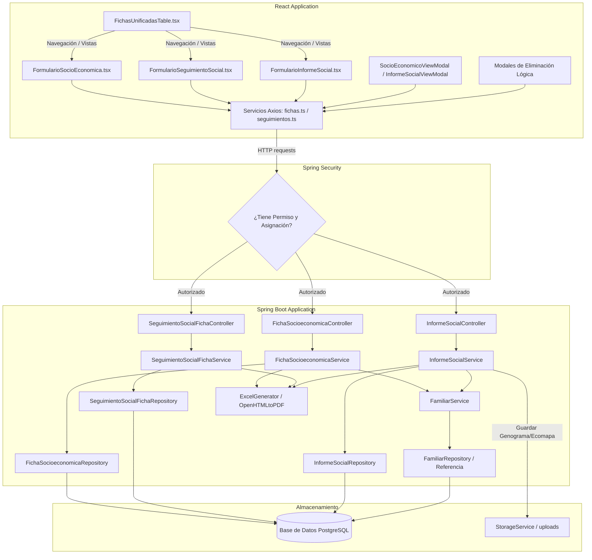
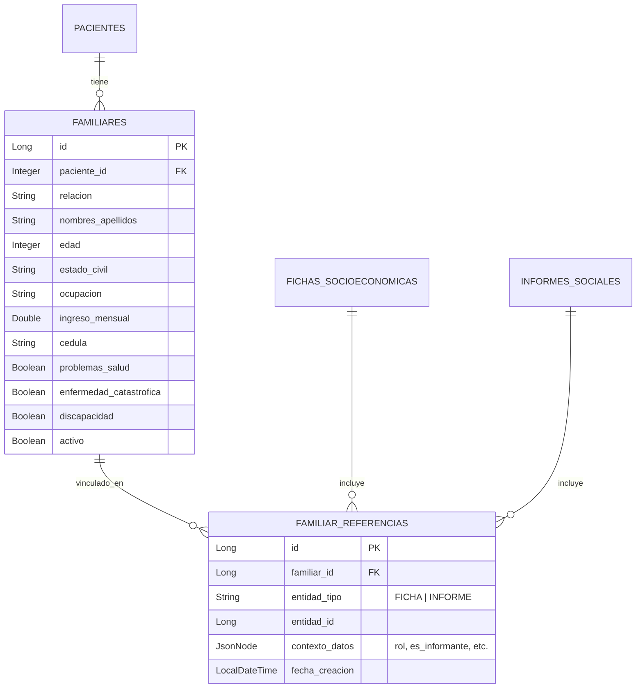

# Documentación Técnica: Implementación de Trabajo Social (Las 3 Fichas)

Este documento detalla la arquitectura, modelo de base de datos, flujos de control, lógica de negocio y componentes de la interfaz de usuario que conforman el módulo de **Trabajo Social** dentro del sistema **UDIPSAI**. 

El módulo de Trabajo Social está compuesto por tres documentos/fichas clave:
1. **Ficha Socioeconómica**
2. **Ficha de Seguimiento Social (Visitas)**
3. **Informe Social**

---

## 1. Arquitectura y Flujo de Información Global

El sistema está dividido en un frontend desarrollado en **React (TypeScript + Tailwind CSS)** y un backend implementado en **Spring Boot (Java + JPA/Hibernate)** con persistencia en **PostgreSQL**.

---

## 2. Modelado de Datos y Base de Datos (JPA / PostgreSQL)

Para evitar la redundancia y mantener una estructura relacional limpia, el sistema utiliza dos estrategias importantes:
* **Objetos Incrustados (`@Embedded` / `@Embeddable`)** en la Ficha Socioeconómica para agrupar campos relacionados en la misma tabla física.
* **Modelo Polimórfico de Referencias Familiares (`FamiliarReferencia`)** para vincular un registro de familiar único (`Familiar`) a diferentes fichas e informes históricos sin duplicar su información.

---

### A. Ficha Socioeconómica
Almacenada en la tabla `fichas_socioeconomicas`. Modela una evaluación socioeconómica exhaustiva.

* **Clase Entidad:** `FichaSocioeconomica.java`
* **Campos Básicos:**
  * `id_numero_ficha` (Integer, PK): Autogenerado.
  * `paciente_id` (ForeignKey a `pacientes`): Paciente evaluado.
  * `especialista_id` (ForeignKey a `especialistas`, Nullable): Especialista responsable.
  * `pasante_id` (ForeignKey a `pasantes`, Nullable): Pasante supervisor/responsable.
  * `activo` (Boolean): Control de eliminación lógica y estado actual.
  * `fecha_elaboracion` (Date): Fecha de registro de la ficha.
  * `paciente_instruccion`, `paciente_ocupacion`, `paciente_email`, `paciente_num_carne`: Información demográfica extendida en el momento del registro.
  * `conclusiones_finales` y `recomendaciones_finales` (TEXT).
  * `nombre_responsable_registro` (String).

* **Componentes Incrustados (`@Embedded`):**
  1. **`RiesgosSociales`**: Campos de problemas sociales, vulnerabilidades y migración (`migroExterior`, `lugarMigracion`, `tiempoMigracion`, `afectacionFamiliar`).
  2. **`VulnerabilidadDetalle`**: Indicadores booleanos (`movilidadHumana`, `enfermedadCatastrofica`, `embarazoAdolescente`, `abusoSexual`, `agresionFisica`, `agresionPsicologica`) y `lugarAgresion`.
  3. **`DinamicaFamiliar`**: Indicadores familiares (`opinionFamiliar`, `unionFamiliar`, `cumplenReglas`, `tieneActividadesFamiliares`) y de descripción en formato TEXT (`resolucionConflictos`, `quienesIncumplenReglas`, `actividadesCompartidas`, `relacionHermanos`, `relacionPadresHijos`, `comunicacionFamiliar`, `tipoHogar`).
  4. **`ViviendaHabitabilidad`**: Tipo de tenencia (`tipoTenencia`), materiales estructurales (`materialParedes`, `materialPiso`, `materialTecho`), servicios y recuentos (`numeroCuartos`, `numeroDormitorios`, `numeroCamas`, `numeroSanitarios`, `procedenciaAgua`, `tipoSanitario`, `tieneElectricidad`, `numeroFocos`, `tieneInternet`, `tieneDucha`).
  5. **`SituacionSalud`**: Detalle médico del paciente (`lugarAtencionMedica`, `saludEstudiante`, `ayudasTecnicas`).
  6. **`DesgloseEconomico`**: Ingresos familiares mensuales (`ingresoPadre`, `ingresoMadre`, `ingresoFamiliares`, `ingresoOtros`) y egresos familiares (`egresoAlimentacion`, `egresoArriendo`, `egresoServiciosBasicos`, `egresoSalud`, `egresoEducacion`, `egresoPrestamos`, `egresoOtros`).
  7. **`SituacionEconomica`**: Campos calculados y descriptivos de la economía del hogar (`totalIngresos`, `totalEgresos`, `condicionEconomica`, `capacidadGastoEvaluacion`, `actividadesTiempoLibre`, `ingresoPerCapita`, `categoriaSocioeconomica`, `grupoSocioeconomico`).

---

### B. Ficha de Seguimiento Social (Visitas)
Almacenada en la tabla `seguimiento_social`. Modela el registro de las visitas de acompañamiento que el trabajador social realiza al hogar o centro educativo.

* **Clase Entidad:** `SeguimientoSocialFicha.java`
* **Campos Principales:**
  * `id` (Integer, PK): Autogenerado.
  * `paciente_id` (ForeignKey a `pacientes`): Paciente de acompañamiento.
  * `areaAcompanamiento` (String): Especialidad o departamento de seguimiento.
  * `numeroSeguimiento` (Integer): Número correlativo del seguimiento para el paciente.
  * `fecha` (LocalDate): Fecha en la que se realizó la visita.
  * `nombreVisitador` y `apellidoVisitador` (String): Datos del profesional que realiza la visita.
  * `direccionVisita` (String): Dirección física donde tuvo lugar la visita.
  * **Cuerpo Técnico (TEXT):**
    * `objetivo`: Propósito del acompañamiento.
    * `participantes`: Personas involucradas durante la visita.
    * `actividades`: Detalle de lo realizado.
    * `observaciones`: Conclusiones y hallazgos.
  * **Datos de Firma / Representante:**
    * `lugarFirma` (String: `CASA`, `ESCUELA`, `OTRO`): Contexto de firma.
    * `nombreRepresentante` (String): En caso de ser el representante del hogar.
    * `rolEscuela` (String) y `nombrePersonalEscuela` (String): En caso de ser personal docente/directivo.
    * `especificarOtro` (String): Campo libre si el lugar de firma fue otro.
  * `activo` (Boolean): Estado para eliminación lógica.

---

### C. Informe Social
Almacenada en la tabla `informes_sociales`. Representa el informe social descriptivo de síntesis diagnóstica para fines legales, escolares o terapéuticos.

* **Clase Entidad:** `InformeSocial.java`
* **Campos Principales:**
  * `id` (Integer, PK): Autogenerado.
  * `paciente_id` (ForeignKey a `pacientes`).
  * `especialista_id` y `pasante_id` (ForeignKeys a los creadores/supervisores).
  * `numFicha` (String): Código/identificador único del informe.
  * `fechaElaboracion` (Date).
  * `activo` (Boolean).
  * `genogramaUrl` y `ecomapaUrl` (String): Enlaces relativos a los archivos cargados de diagramas familiares.
  * `tipoFamilia` (String) y `tipoFamiliaEspecificar` (String).
  * **Secciones Descriptivas (TEXT):**
    * `descripcionDinamicaFamiliar`, `situacionEconomica`, `situacionHabitabilidad`, `situacionLaboral`, `situacionEntorno`, `situacionEducativoCultural`, `situacionSalud`, `situacionLegal`.
  * **Cierre Profesional (TEXT):**
    * `valoracionProfesional` (Diagnóstico de Trabajo Social).
    * `recomendaciones` (Plan de intervención sugerido).
  * `elaboradoPor` (String).

---

### D. Modelo de Familiares (`Familiar` y `FamiliarReferencia`)
En lugar de que cada ficha socioeconómica o informe social tenga una lista privada de familiares embebida en cascada rígida, la información del núcleo familiar del paciente se gestiona centralizadamente.

* **`Familiar.java`**: Almacena los datos personales, ocupación, salud y situación de discapacidad del familiar. Está indexado por `paciente_id` y `cedula`.
* **`FamiliarReferencia.java`**: Mapea la relación física.
  * `entidadTipo` ("FICHA" o "INFORME"): Indica a qué formulario pertenece la relación.
  * `entidadId` (Long): Contiene el ID numérico de la `FichaSocioeconomica` o `InformeSocial` respectivo.
  * `contextoDatos` (JSONB): Permite añadir metadatos dinámicos a la relación (ej. en un informe se añade `{"rol": "informante", "es_informante": true}`).

---

## 3. Lógica de Negocio y Servicios (Backend)

### A. Gestión de Historial y Versiones
Cuando un usuario crea una nueva **Ficha Socioeconómica** o **Informe Social**:
1. El backend busca si ya existe un registro activo (`activo = true`) para el paciente.
2. Si existe un registro anterior, este **no se borra**, lo que permite conservar la trazabilidad y evolución histórica.
3. El frontend permite recuperar el historial mediante los endpoints `/historial/{pacienteId}` correspondientes para desplegar todas las fichas previas ordenadas por fecha en una línea de tiempo.

### B. Cálculo Automático de Situación Económica (`FichaSocioeconomicaService`)
Al guardar o editar una ficha socioeconómica, el backend procesa los ingresos del desglose económico:
* Calcula automáticamente el total de ingresos y egresos de la familia.
* Suma todos los ingresos mensuales individuales de los familiares vinculados a la ficha a través de las referencias familiares.
* Calcula el ingreso per cápita (`ingresoPerCapita = totalIngresos / numeroMiembrosHogar`).
* Categoriza automáticamente el rango socioeconómico basándose en las variables del total de ingresos del hogar.

---

## 4. Control de Acceso y Seguridad

El sistema implementa seguridad a nivel de métodos usando anotaciones de **Spring Security** y expresiones de Spring (SpEL):

1. **Filtro de Asignación de Pasantes (`AsignacionSecurityService`):**
   Un pasante de Trabajo Social solo puede acceder a pacientes que le han sido explícitamente asignados por un especialista administrador.
   * La anotación `@asignacionSecurity.checkPasanteAcceso(#pacienteId)` intercepta las peticiones GET, POST, PUT y DELETE.
   * Si el usuario autenticado tiene el rol `ROLE_PASANTE`, se valida que exista un registro de asignación activa en la tabla `asignaciones` entre su ID de pasante y el `pacienteId`. Si no está asignado, el backend responde con un `403 Forbidden`.
   
2. **Autorizaciones Granulares de Permisos (Authorities):**
   Cada endpoint está protegido mediante `@PreAuthorize("hasAuthority('...')")`:
   * **Ficha Socioeconómica:** `PERM_SOCIOECONOMICA`, `PERM_SOCIOECONOMICA_CREAR`, `PERM_SOCIOECONOMICA_EDITAR`, `PERM_SOCIOECONOMICA_ELIMINAR`.
   * **Ficha de Seguimiento Social:** `PERM_SEGUIMIENTO_SOCIAL`, `PERM_SEGUIMIENTO_SOCIAL_CREAR`, `PERM_SEGUIMIENTO_SOCIAL_EDITAR`, `PERM_SEGUIMIENTO_SOCIAL_ELIMINAR`.
   * **Informe Social:** `PERM_INFORME_SOCIAL`, `PERM_INFORME_SOCIAL_CREAR`, `PERM_INFORME_SOCIAL_EDITAR`, `PERM_INFORME_SOCIAL_ELIMINAR`.

---

## 5. Generación y Descarga de Reportes (Thymeleaf + OpenHTMLtoPDF)

Cada una de las tres fichas cuenta con un flujo dedicado para la exportación a formato digital impreso (PDF y Excel):

### A. Reportes en PDF
1. El controlador recibe la petición de descarga (ej. `/api/informes-sociales/reporte/pdf/id/{id}`).
2. El servicio de reportes obtiene el DTO completo y sus familiares vinculados.
3. Se inyecta el DTO en un contexto de **Thymeleaf** (`org.thymeleaf.context.Context`).
4. Thymeleaf procesa la plantilla HTML correspondiente en `src/main/resources/templates/reportes/`:
   * `fichasocial-detalle.html`: Maquetación formal con tablas de ingresos/egresos, datos de vivienda y riesgos.
   * `seguimiento_social_detalle.html`: Reporte de la visita de seguimiento y firmas.
   * `informesocial-detalle.html`: Incluye las secciones descriptivas e inserta dinámicamente las imágenes de los diagramas del genograma y ecomapa.
5. El HTML procesado se envía al motor **OpenHTMLtoPDF** para renderizar las páginas y generar el flujo de bytes (`byte[]`) del PDF con soporte para CSS impreso (saltos de página controlados `@page`, cabeceras repetitivas y estilos limpios).

### B. Reportes en Excel
* Se utiliza un generador genérico (`ExcelGenerator.java`) basado en Apache POI.
* El servicio pasa el listado de fichas asociadas y una expresión lambda que define cómo mapear cada fila de la hoja de cálculo con los campos y las sub-estructuras unificadas.

---

## 6. Frontend y Formularios React

La interfaz de usuario en el frontend está integrada en el componente principal `FichasUnificadasTable.tsx` bajo la pestaña de "Trabajo Social". Las tres sub-pestañas administran las vistas:

### A. Formulario Ficha Socioeconómica (`FormularioSocioEconomica.tsx`)
Se organiza visualmente en secciones modulares mediante pestañas internas o pasos (stepper) debido a la enorme cantidad de campos:
* **Información del Paciente:** Carga automática de los datos básicos de filiación del paciente.
* **Conformación Familiar:** Tabla interactiva para añadir, editar y remover familiares. Llama al servicio de familiares y mantiene la sincronización de IDs.
* **Vivienda y Habitabilidad:** Radio-buttons e inputs numéricos estructurados.
* **Situación de Salud:** Entrada de problemas de salud y ayudas técnicas requeridas.
* **Ingresos y Egresos Familiares:** Inputs de tipo numérico con cálculos reactivos en tiempo real del saldo familiar mensual (Ingresos totales - Egresos totales).
* **Vulnerabilidades y Riesgos:** Checkboxes de factores de riesgo con campos adicionales condicionales (ej. detalles de la migración si `migroExterior` es `true`).
* **Conclusiones y Recomendaciones:** Campos extensos de texto.

### B. Formulario de Seguimiento Social (`FormularioSeguimientoSocial.tsx`)
Es una interfaz lineal más enfocada en la narrativa técnica:
* Permite seleccionar el área de acompañamiento y calcula de forma automática el número correlativo del seguimiento.
* Secciones técnicas extensas para el ingreso de objetivos, actividades del visitador y observaciones.
* Selector dinámico del tipo de firma (`CASA`, `ESCUELA`, `OTRO`), ocultando y mostrando inputs relevantes (ej. si es escuela, solicita el rol y el nombre del personal docente).

### C. Formulario de Informe Social (`FormularioInformeSocial.tsx`)
Enfocado en la valoración final del caso:
* **Carga de Archivos de Diagramas:** Componente especializado de carga de archivos (`Drag and Drop`) para subir imágenes PNG/JPG de **Genograma** y **Ecomapa**.
* **Campos Narrativos:** Editor de texto o campos de texto multilinea extensos para cada dimensión del informe (Laboral, Educativa, Legal, Entorno, Dinámica Familiar, etc.).
* **Envío Multipart-Data:** A diferencia de otros formularios simples que se envían como JSON directo, este formulario construye un `FormData` en Javascript, inserta el archivo JSON serializado bajo la clave `informe`, y los archivos binarios de imágenes bajo las claves `genograma` y `ecomapa`. Luego se despacha al endpoint `POST /api/informes-sociales/crear`.

---

## 7. Tabla Resumen de Operaciones API

| Módulo | Endpoint / Ruta Backend | Verbo | Tipo de Contenido | Permiso Requerido |
| :--- | :--- | :--- | :--- | :--- |
| **Ficha Socioeconómica** | `/api/fichas-socioeconomicas/crearFicha` | `POST` | `application/json` | `PERM_SOCIOECONOMICA_CREAR` |
| | `/api/fichas-socioeconomicas/socioeconomicas/{id}` | `PUT` | `application/json` | `PERM_SOCIOECONOMICA_EDITAR` |
| | `/api/fichas-socioeconomicas/historial/{pacienteId}` | `GET` | `application/json` | `PERM_SOCIOECONOMICA` |
| | `/api/fichas-socioeconomicas/reporte/pdf` | `GET` | `application/pdf` | `PERM_SOCIOECONOMICA` |
| **Seguimiento Social** | `/api/seguimientos-sociales` | `POST` | `application/json` | `PERM_SEGUIMIENTO_SOCIAL_CREAR` |
| | `/api/seguimientos-sociales/{id}` | `PUT` | `application/json` | `PERM_SEGUIMIENTO_SOCIAL_EDITAR` |
| | `/api/seguimientos-sociales/paciente/{pacienteId}` | `GET` | `application/json` | `PERM_SEGUIMIENTO_SOCIAL` |
| | `/api/seguimientos-sociales/reporte/pdf` | `GET` | `application/pdf` | `PERM_SEGUIMIENTO_SOCIAL` |
| **Informe Social** | `/api/informes-sociales/crear` | `POST` | `multipart/form-data` | `PERM_INFORME_SOCIAL_CREAR` |
| | `/api/informes-sociales/{id}` | `PUT` | `multipart/form-data` | `PERM_INFORME_SOCIAL_EDITAR` |
| | `/api/informes-sociales/paciente/id/{pacienteId}/historial` | `GET` | `application/json` | `PERM_INFORME_SOCIAL` |
| | `/api/informes-sociales/reporte/pdf/id/{id}` | `GET` | `application/pdf` | `PERM_INFORME_SOCIAL` |
